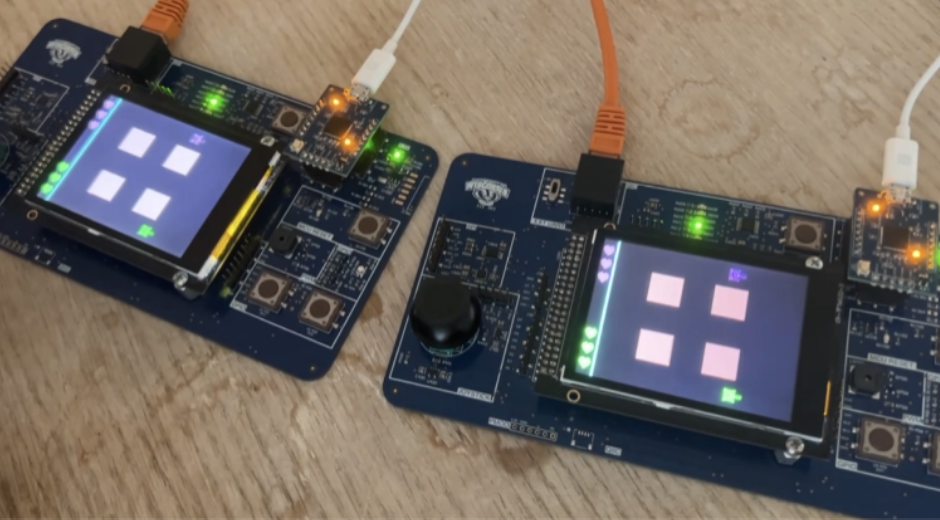

  

## What I Did
- Programmed and extensively debugged a PsoC6 based board to create a two player tank duel game in C++.

## How I Did It
- Used **FreeRTOS** for real time user controls via tasks, semaphores, and qeueus.
- Used **UART** for inter-board data transfer, ensuring <10 ms lag between transmitted player states.
- Interfaced multiple sensors (joystick, pushbutton, IMU) over **I2C**, used interrupt-driven design for latency-critical inputs.

## Outcomes
- Learned how to use FreeRTOS to create **responsive, real time MCU projects**.
- Gained proficiency with the UART communication protocol for inter device communication.
- Learned to quickly peruse **documentation** to find crucial information.
